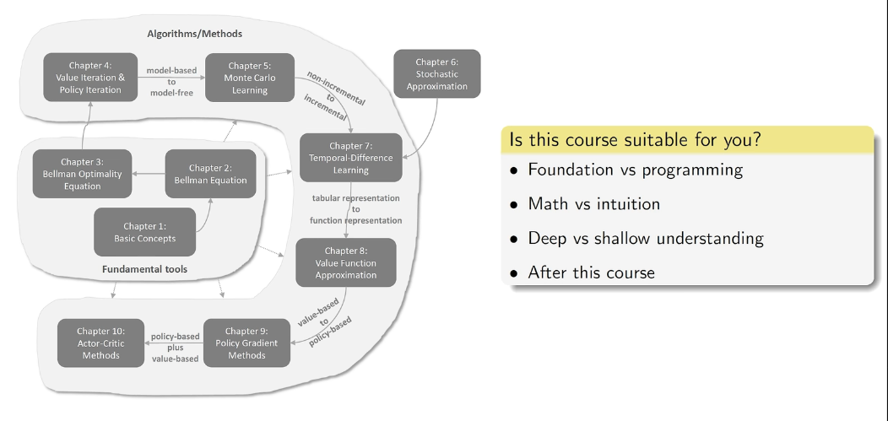
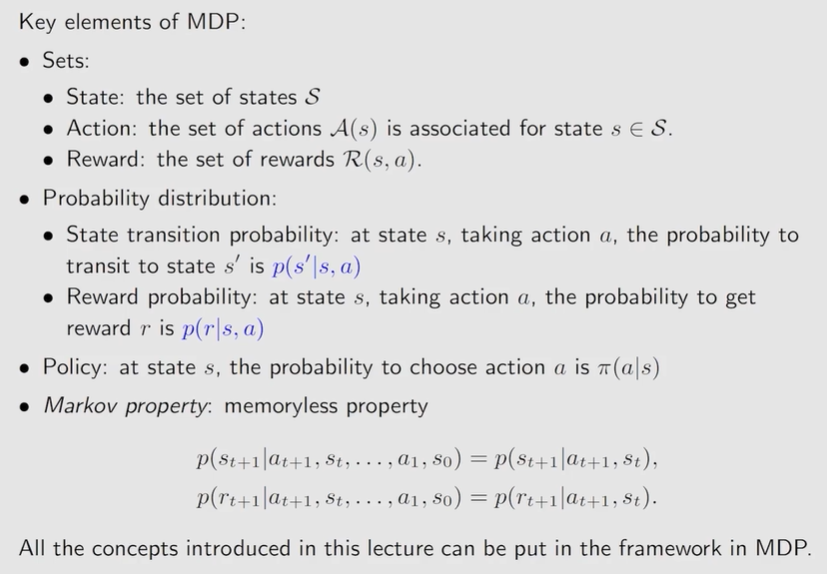
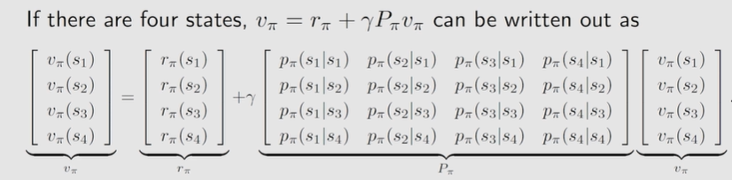
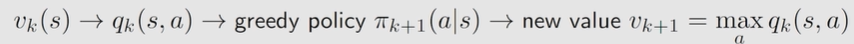
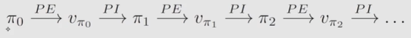
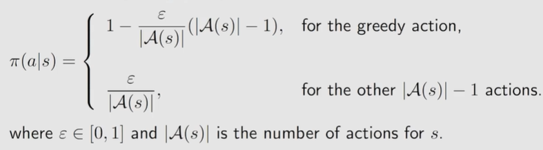

## 强化学习的基础数学原理
> [【强化学习的数学原理】课程：从零开始到透彻理解](https://www.bilibili.com/video/BV1sd4y167NS)笔记

### 基本概念
* state：物体相对于环境的状态
* state space：所有状态的集合
* action & action space：动作空间依赖于状态，状态不同，动作空间可能不同
* state transition：定义物体与环境的交互方式，动作空间对状态空间的影响
* * tabular representation：以表格的形式表示state transition，清晰但是只能表示情况唯一确定的情况，对状态A+动作A可能等于多个动作B的情况无法表示
* * state transition probability：条件概率表示，可以表示多个状态
* policy：告诉agent在每个state应该使用什么action，仍旧使用条件概率
* * stochastic policy：非确定策略，条件概率有两个及以上非零项
* reward：物体采取一个action后获得的实数，正负数代表是否想要这一行为发生
* * 可以使用0reward，非惩罚在一定程度上会鼓励
* * 可以使用正数表惩罚，负数表鼓励，后续数学上处理不同
* * **reward依赖于目前状态而非下一个状态**
* trajectory：state-action-reward chain，一直重复到达到target
* * return：一个trajectory的所有reward的总和
* * discounted return：有时候物体卡在一个状态后会一直获得reward，最后的return就是无穷大，但是如果给每个return前加入一个系数，可以把发散的return变为收敛，且通过调整系数可以调整过去和最近的reward对整体的影响$$ return = reward_1*\gamma+reward_2*\gamma^2+reward_3*\gamma^3……,0<\gamma<1$$
* terminal states：最终状态，到达后就停止
* Episode：到达terminal states就停止的trajectory
* continuing tasks：没有terminal states的任务
* absorbing state：在这个状态的时候只有保持原状态这一种动态空间，可以通过把terminal state设为absorbing state来得到episodic tasks和continuing tasks的转换

### Markov decision process
> MDP elements: Sets[state,action,reward],Probability distribution,Policy,**Markov property**
* Markov property：特性是memoryless，当前的状态转移概率与历史没有关系，仅与当前情况有关
* MDP：M表示Markov property这种memoryless特性；decision表示决策和决策的Policy；Process表示了过程，其中可能用到的状态Sets与Probability distribution
* MDP在policy确定后，就可以转变为一个Markov process

-------------------------------------------
### state value
* bootstrapping：自举法，从数据自己出发迭代得到的一系列结果；在RL中可以指return依赖其他状态的return
* 单步状态转移：$S_t \stackrel{A_t}{\longrightarrow}R_{t+1},S_{t+1}$
* $S_t$时采取什么action由policy决定，得到什么reward由reward probability决定，转移到$S_{t+1}$由state transition probobility决定
* 多步轨迹：$S_t \stackrel{A_t}{\longrightarrow}R_{t+1},S_{t+1}\stackrel{A_{t+1}}{\longrightarrow}R_{t+2},S_{t+2}…$
* discounted return:$G_t = R_{t+1}+\gamma R_{t+2}+\gamma^2R_{t+3}…$
* **state value全称state value function，是$G_t$在$S_t=s$时的条件期望值**
* state value是关于s的函数，s表示初始状态；基于policy[$\pi$]，policy不同则state value不同；state value越大代表策略越符合评价标准；
* 在policy唯一确定时，多个轨迹求均值和一条轨迹完全相同，此时return与state value相等；但是policy一旦不确定，即在一个状态下有多种可能的action，state value很明显更全面的反映了policy的好坏

### Bellman Equation推导
* Bellman equation是计算state value的工具，它描述了不同状态的state value之间的关系
* $G_t = R_{t+1}+\gamma R_{t+2}+\gamma^2R_{t+3}…=R_{t+1}+\gamma G_{t+1}$
* state value：
$$v_{\pi}(s)=E[G_t|S_t=s]E[R_{t+1}+\gamma G_{t+1}|S_t=s]\\=E[R_{t+1}|S_t=s]+\gamma E[G_{t+1}|S_t=s]$$
* $E[R_{t+1}|S_t=s] = {\sum_{a}^a}\pi(a|s){\sum_{r}}p(r|s,a)r$
* 在状态s可能有多个action，每个action和目前状态可能能够获取多种reward，双重求和可以获取这个双重条件概率的加权平均
* $E[G_{t+1}|S_t=s]= \sum E[G_{t+1}|S_{t+1}=s^{\prime}]p(s^{\prime}|s)={\sum_{s'}}v_{\pi}(s')p(s'|s)={\sum_{s'}}v_{\pi}(s'){\sum_{a}}p(s'|s,a)\pi(a|s)$
* 这一步以后的$G_t$是下一步的所有可能的$G_t$的加权平均，而下一步由于马尔可夫过程的性质，与这一步已经没有关系；s到s'的概率是由s在a采取什么action，s和action又会导致什么s'的双因素决定
* **$$\Rightarrow v_{\pi}(s)={\sum_{a}}\pi(a|s)[{\sum_{r}}p(r|s,a)r+\gamma{\sum_{s'}}p(s'|s,a)v_{\pi}(s')]$$**
* Bellman equation由两项组成，一项是现在的reward，一项是未来的reward；本方程对于状态空间中所有状态均成立，建立状态组矩阵按线性代数解法或联立方程可以求出所有状态的state value
* $v_{\pi}(s),v_{\pi}(s')$是需要计算的state value，需要根据自举法计算
* $\pi$这一概率来自policy，另外的概率来自dynamic/environment model

### Bellman equation Matrix-vector form
* Bellman equation最简形式：$v_{\pi}=r_{\pi}+\gamma P_{\pi}v_{\pi}$
* 其中v和r是向量，P是$n×n$矩阵被，称为状态转移矩阵，$P[i][j]$代表$s_i$跳到$s_j$的概率

* 实际上解矩阵方程的时候维数较多，不会使用求逆的解法而是使用迭代的解法
* $v_{k+1}=r_{\pi}+\gamma P_{\pi}v_{k}$，依次迭代得到$[{v_0,v_1,v_2,…}]$，当k趋近于无穷时$v_k$会收敛到$v_{\pi}$，此时$v_k$仍旧是一个向量，其中每个状态初始值可以任意；下标代表的是迭代次数而非状态

### action value
* action value是从一个状态出发并采取了一个action之后得到的average return
* $q_{\pi}(s,a)=E[G_t|S_t=s,A_t=a]$，同时依赖于policy，state和action
*  $$v_{\pi}(s)={\sum_{a}}\pi(a|s)q_{\pi}(s,a)$$
*  **$$q_{\pi}(s,a)={\sum_{r}}p(r|s,a)r+\gamma{\sum_{s'}}p(s'|s,a)v_{\pi}(s')$$**
* 知道了所有的action，加权平均即可求出state value，知道了所有的state value也可以求出action value
* policy即使唯一确定一个方向，其他方向的action value仍旧重要，因为目前的状态不一定是最优策略
* 可以先计算state value，再依次算出所有的action value；但我们也可以不依赖于模型直接计算action value，这就是有模型和无模型的学习问题

---------------------------------------------------------
### optimal policy
* 最优策略在任意state相比任意其他策略得到的state value都要更大
* Bellman optimality equation(BOE)：$v(s)=max_{\pi}{\sum_{a}}\pi(a|s)q_{\pi}(s,a)$
* 矩阵形式：$v = max_{\pi}(r_{\pi}+\gamma P_{\pi}v)$
* 需要求解最优的策略$\pi$，此时v和$\pi$都是未知量
* 对Bellman optimality equation，假设state有三个action，故$v(s)=max c_1q_1+c_2q_2+c_3q_3$，且由于c是概率，有$c_1+c_2+c_3=1$，故$v(s)\leq max(q_1,q_2,q_3)$，c在最大项取1，别的项取0
* 由上述思路可得最优state value：$v(s)=max(q(s,a))$
* 令$f(v)=max_{\pi}(r_{\pi}+\gamma P_{\pi}v)$，BOE变为$v=f(v)$

### BOE solution
* fixed point：$f(x)=x$，$x$即为$f(x)$的不动点
* contraction function：满足$||f(x_1)-f(x_2)||\leq \gamma ||x_1-x_2||$，$\gamma$属于0到1。表示两个向量经过f映射以后，两者之差的范数，即两者的距离变短了；由此表现出收缩的性质
* contraction function theorem：当不动点存在且唯一且$f(x)$是收缩函数时，使用$x_{k+1}=f(x_k)$进行迭代，$f(x_k)$最后会收敛至不动点
* 在BOE中，$f(v)$就是收缩函数，且收缩函数的$\gamma$就是discount rate的$\gamma$
* BOE唯一存在一个最优解v，因此使用$v_{k+1}=f(v_k)=max_{\pi}(r_{\pi}+\gamma P_{\pi}v)$进行迭代可以求出不动点$v$，也就是BOE要求的$v$
* BOE迭代过程解释：$v(s)=max_{\pi}{\sum_{a}}\pi(a|s)q_{\pi}(s,a)$中，目前的state value已知或有一个估计量，则$q_{k}(s,a)$已知，可以求得$v_{k+1}$，经过迭代收敛至不动点
* BOE求得最优state value $v^*$，反代回去可以求得最优策略$\pi^*$，此时有$v^*=r_{\pi^*}+\gamma P_{\pi}^*v^*$，BOE此时变为了满足最优策略的Bellman equation，因此BOE是一种特殊的Bellman equation

### BOE properties
* 对BOE的完整形式：$v(s)=max_{\pi}{\sum_{a}}\pi(a|s)[{\sum_{r}}p(r|s,a)r+\gamma{\sum_{s'}}p(s'|s,a)v_{\pi}(s')]$，实际上除了state value和policy以外，所有的概率、reward全是已知量，由强化学习的模型决定
* 修改$\gamma$：$\gamma$越大，策略越远视，会考虑更多步以后的情况；极端情况下$\gamma$为0，则最优policy对应的state value就等于当前步骤的最大reward
* 修改reward：$r_{new}=ar+b$，线性修改reward时不会影响最优策略；最优策略不关注reward的绝对值，而是各个状态之间的reward相对值
* 想要获取最短路径，除了每一步给出一个负reward表示能量消耗以外，折扣因子也可以起到鼓励最短策略的效果

---------------------------------------------
### Value Iteration Algorithm
* 之前使用Bellman Optimality equation求解最优的state value并反求最优策略的方法就是Value Iteration
* 矩阵形式通常用于理论分析，实际实现时更需要关注数值形式
* 具体流程总结

  

  在state value收敛以前，一直进行上述策略和value的迭代过程

### Policy Iteration Algorithm
* 具体流程总结

  

* 初始给定一个策略，根据这个策略可以求解出目前的最优state value，并根据这个state value来更新策略
* 与值迭代相比，初始给定的变量不同，在求解state value时策略迭代需要迭代求解Bellman equation，值迭代直接代入求得新的v 

### Truncated Policy Iteration Algorithm
* 在根据策略计算state value时，值迭代仅进行了一次计算，策略迭代需要进行无穷次计算
* policy iteration在计算最优state value时理论上需要迭代无穷多次，因此在实际上不可能存在
* turncated policy iteration 则是在计算策略对应的state value时执行给定次数次的迭代
* 未进行无穷多次会导致输出的state value不是目前的策略对应的最大state value，但是公式仍旧收敛，能够逼近最优策略
* truncated policy iteration的关键参数就是迭代次数，次数为1是就是值迭代，次数变大就趋近策略迭代；增加迭代次数可以一定程度减少更新次数，但是迭代次数增大的过多会导致加速效果越来越不明显

-----------------------------------------
### MC Basic
*  $$v_{\pi}(s)={\sum_{a}}\pi(a|s)q_{\pi}(s,a)$$
*  **$$q_{\pi}(s,a)={\sum_{r}}p(r|s,a)r+\gamma{\sum_{s'}}p(s'|s,a)v_{\pi}(s')$$**
* **$$q_{\pi}(s,a)=E[G_t|S_t=s,A_t=a]$$**
*  上面两种定义一种依赖于模型的状态转移概率，而基于期望的定义则不需要模型
*  使用从某个(s,a)出发得到的return作为采样，多次采样求均值得到$G_t$的估计值；没有模型就必须要有数据用于估计
*  MC Basic与策略迭代算法几乎相同，但是在求解$v_{\pi}$时不同。策略迭代基于模型使用贝尔曼方程得到state value再计算action value $q_{\pi}(s,a)$，而MC Basic通过采样求均值直接得到 $q$
* MC Basic能够很好的解释有模型向无模型的迁移过程，但是效率很低，无法使用
* 采样有两个关键参数：采样的次数和单次采样的step数；如果是模型环境均确定的条件下，一次采样就能得到准确期望，如果有不确定的情况则需要多次采样取均值；另外，单次采样的step数至少要足够长，使得每个(s,a)都有可能在限定的步数内到达目标获得return

### MC Exploring Starts
* 上述方法仅以采样episode的出发点作为(s,a)的有效采样，求所有从(s,a)的episode所得到回报的均值，称为first-visit
* 但是实际上我们一次episode后面也可能经过(s,a)，如果将后面经过得到的回报均值也作为有效采样，即求所有出现的(s,a)而的回报均值称为Every-visit
* 但是未从(s,a)出发则无法保证后续一定经过(s,a)，因此仍旧需要遍历每一个(s,a)使其作为起点生成episode，称为Exploring Starts，此时使用fisrt-visit即可
* Exploring Starts和无限个episode求期望在实际上都是不可能的，在使用时我们必须想办法简化掉这两个假设
* 原则上需要无限个episode才能真实反映action value，则我们可以在策略提升前放弃完全的策略评估，极端的情况就是值迭代(Value Iteration)，就是在每两次策略提升之间仅进行一次策略评估，仍旧可以收敛

### MC $\epsilon-$Greedy(without Exploring Starts)
* soft policy：在一个状态执行本状态所有动作的概率都大于0的策略
* $\epsilon-$Greedy

  

* 与之前的greedy策略相比，此策略能够探索非最优的动作。只要从某一个状态出发，给出一个非常长的episode并使用Every-visit，只要episode足够长，就能够探索到所有的(s,a)，此时不需要Exploring Starts
* 使用$\epsilon-$Greedy的目的是希望平衡利用与探索
* $\epsilon$越大越趋近于探索，越小越趋近于利用；极端情况下$\epsilon$为1时所有策略概率均等，只有探索，$\epsilon$为0时与greedy相同，只有利用
* 可以使用变化的$\epsilon$先大后小，先鼓励探索，在探索一段时间后鼓励最优
* 在实际使用时，我们要把$\epsilon-$greedy策略转化为greedy策略进行使用
------------------------------------

### mean estimation
* 根据采样得到的$\bar{x}$来估计x的期望
* 可以当所有的采样完成以后再求均值，也可以使用增量式的思想，每当来一个采样就进行一次迭代，逐渐准确的逼近期望
* $w_{k+1}=w_k-\frac{1}{k}(w_k-x_k)$，通过这种迭代的式子就可以使用上一个均值来得到下一个均值而不是重新加起来再去除法

### Robins-Monro Algorithm
* 问题：最小化一个函数$J(w)$，可转化为求解$g(w)=\nabla J(w)=0$的根，梯度为0是函数极值的必要条件，如果函数本身单调就变为充要条件
* $w_{k+1}=w_k-a_k\tilde{g}(w_k,\eta_k)$，其中$\tilde{g}(w_k,\eta_k)=g(w_k)+\eta_k$，说明$\tilde{g}(w_k,\eta_k)$是$w_k$的有误差的观测值，$\eta_k$即为误差
* Robins-Monro Algorithm可以求出结果的条件:

  

* 第一条说明函数递增且导数有上界
* 第二条说明$a_k$收敛到0，且并非很快收敛到0；$\frac{1}{k}$就满足条件
* 第三条说明噪声$\eta$的期望应该为0且有界，不要求其为高斯噪声
* 实际使用时不使用$\frac{1}{k}$作为系数，而是通常使用一个很小的常数
* mean estimation实际上是RM算法的一种，其转换关系如下：

  

### SGD
* GD: $w_{k+1}=w_k-a_k \nabla E(f(w_k,X))=w_k-a_k E(\nabla f(w_k,X))$
* GD的梯度是准确梯度，在实际中这一期望基本不可能准确求出

  

* BGD的梯度使用所有的采样进行估计并求均值
* SGD的梯度每次使用随机一个采样进行估计
* MBGD的梯度使用随机k个采样进行估计
* MBGD的k取1时就是SGD，MBGD在k取n时却不是BGD；BGD的每个采样只使用一次，而MBGD的采样是随机的，可能出现重复采样
* 收敛轮数BGD最快，SGD最慢
* 对SGD而言，$w$离最优值越远，采样的随机误差影响就越小；因此SGD在一开始就能够保证$w$向着最优方向迭代而不会一开始就向着错误的方向移动

* 通过上图的构造可以把SGD构造为一个RM函数，由此可知SGD是收敛的
* 我们的SGD涉及到一个随机噪声量，由此要求X是随机变量的采样，而如果我们的采样已经采完了，得到了一个确定的X的集合，则需要手动构造随机变量X使其在集合内等概率的随机选取采样值，由此实现了将固定量的集合变为随机变量的效果

-------------------------------------------