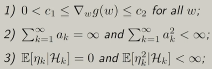
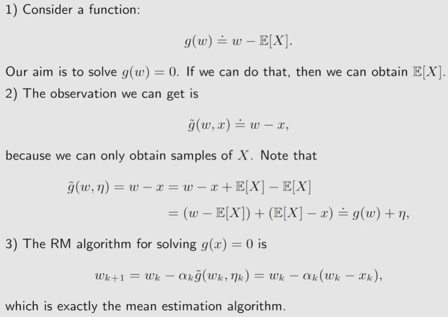
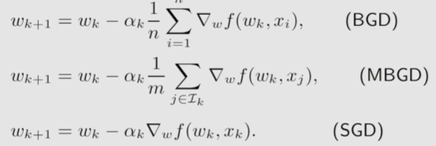

### mean estimation
* 根据采样得到的$\bar{x}$来估计x的期望
* 可以当所有的采样完成以后再求均值，也可以使用增量式的思想，每当来一个采样就进行一次迭代，逐渐准确的逼近期望
* $w_{k+1}=w_k-\frac{1}{k}(w_k-x_k)$，通过这种迭代的式子就可以使用上一个均值来得到下一个均值而不是重新加起来再去除法

### Robins-Monro Algorithm
* 问题：最小化一个函数$J(w)$，可转化为求解$g(w)=\nabla J(w)=0$的根，梯度为0是函数极值的必要条件，如果函数本身单调就变为充要条件
* $w_{k+1}=w_k-a_k\tilde{g}(w_k,\eta_k)$，其中$\tilde{g}(w_k,\eta_k)=g(w_k)+\eta_k$，说明$\tilde{g}(w_k,\eta_k)$是$w_k$的有误差的观测值，$\eta_k$即为误差
* Robins-Monro Algorithm可以求出结果的条件:

* 第一条说明函数递增且导数有上界
* 第二条说明$a_k$收敛到0，且并非很快收敛到0；$\frac{1}{k}$就满足条件
* 第三条说明噪声$\eta$的期望应该为0且有界，不要求其为高斯噪声
* 实际使用时不使用$\frac{1}{k}$作为系数，而是通常使用一个很小的常数
* mean estimation实际上是RM算法的一种，其转换关系如下：

### SGD
* GD: $w_{k+1}=w_k-a_k \nabla E(f(w_k,X))=w_k-a_k E(\nabla f(w_k,X))$
* GD的梯度是准确梯度，在实际中这一期望基本不可能准确求出

* BGD的梯度使用所有的采样进行估计并求均值
* SGD的梯度每次使用随机一个采样进行估计
* MBGD的梯度使用随机k个采样进行估计
* MBGD的k取1时就是SGD，MBGD在k取n时却不是BGD；BGD的每个采样只使用一次，而MBGD的采样是随机的，可能出现重复采样
* 收敛轮数BGD最快，SGD最慢
* 对SGD而言，$w$离最优值越远，采样的随机误差影响就越小；因此SGD在一开始就能够保证$w$向着最优方向迭代而不会一开始就向着错误的方向移动

* 通过上图的构造可以把SGD构造为一个RM函数，由此可知SGD是收敛的
* 我们的SGD涉及到一个随机噪声量，由此要求X是随机变量的采样，而如果我们的采样已经采完了，得到了一个确定的X的集合，则需要手动构造随机变量X使其在集合内等概率的随机选取采样值，由此实现了将固定量的集合变为随机变量的效果